# Credit Card Default Prediction

This repository contains the code for predicting credit card defaults based on customer profiles and historical records. The objective of this project is to build a model that can identify borrowers who are likely to default in the next two years with a serious delinquency of having been delinquent for more than three months.

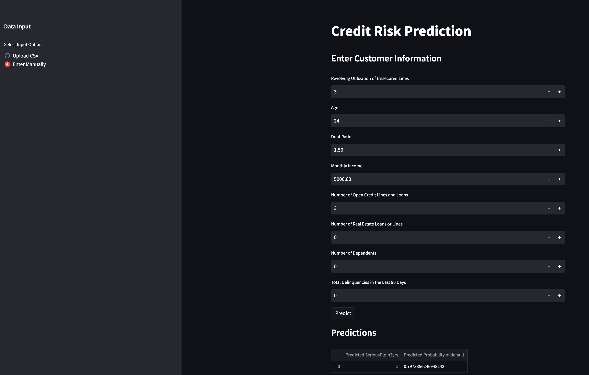

You can access the deployed app for credit card default prediction [here](https://jacobj215-credit-card-default-app-3ruasg.streamlit.app/)

## Notebook 
[View notebook](credit_card_default.ipynb)

The notebook contains the following sections:

Libraries Used
pandas
numpy
matplotlib.pyplot
seaborn
plotly
xgboost
lightgbm
imblearn

### Load Data
The dataset used for this project is stored in the file "cs-training.csv". The dataset contains information about borrowers and whether they have defaulted on their credit card payments. The dataset includes attributes such as the borrower's age, income, number of dependents, and other financial indicators.

### Exploratory Data Analysis
In this section, various exploratory data analysis tasks were performed, including:

* Checking data types and null values.
* Obtaining descriptive statistics.
* Plotting the distribution of delinquency.

  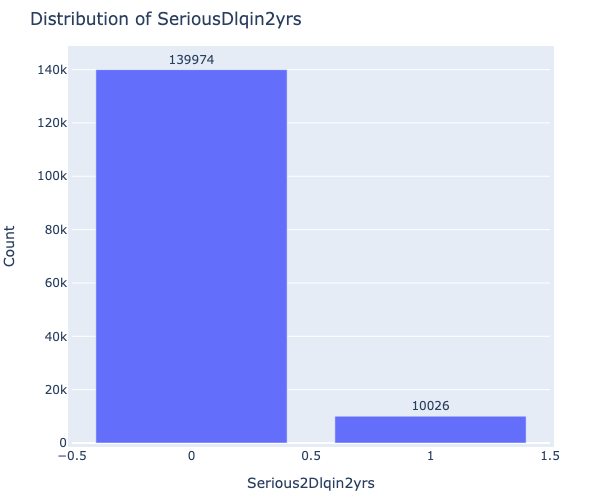
  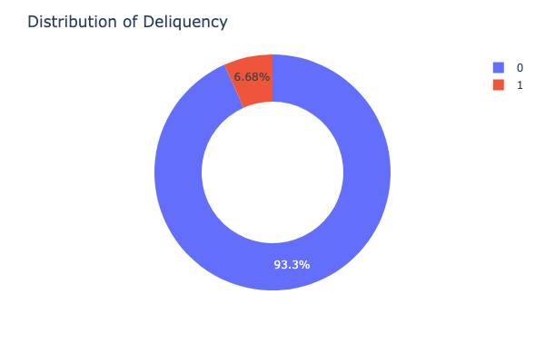 

    As you can see 10026 or 6.68% of the customers in the dataset have SeriousDlqin2yrs
    
* Exploring the correlation between features using a heatmap.

  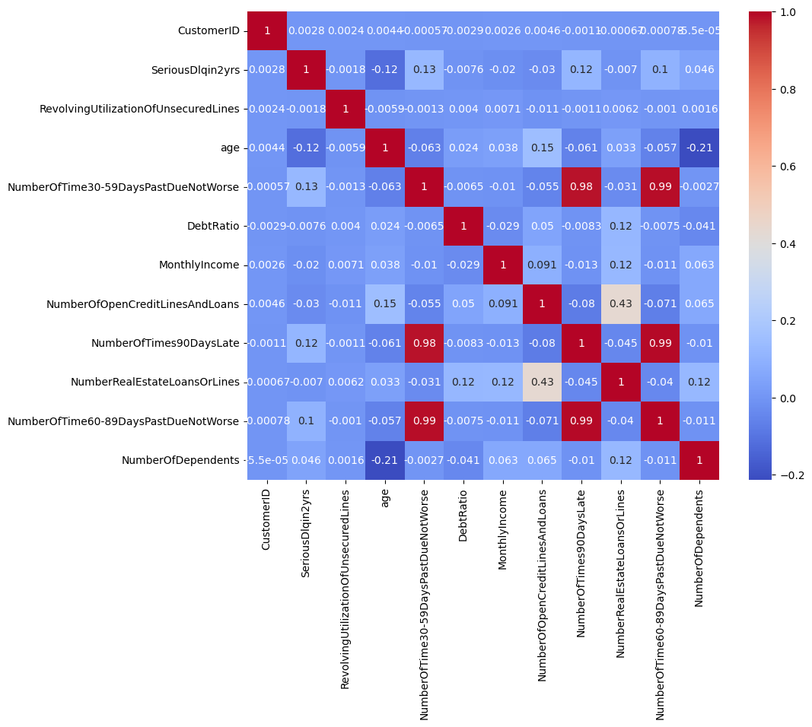

'NumberOfTimes90DaysLate', 'NumberOfTime60-89DaysPastDueNotWorse' 
'NumberOfTime30-59DaysPastDueNotWorse' are all highly correlated, we will aggregate into a single feature 'TotalDelinquencies90DaysLate'

* Visualizing the distribution of age and monthly income.
* Analyzing the relationship between age/monthly income and delinquency.

### Data Preprocessing
The data preprocessing steps include:

* Dropping unnecessary columns, such as customer ID.
* Creating a composite feature called "TotalDelinquencies90DaysLate" by combining related columns.
* Handling missing values and scaling numerical features using StandardScaler.
* Splitting the data into training, validation, and test sets.

### Model Training and Experimentation
In this section, several machine learning models were trained and evaluated. The following models were used:

* Logistic Regression
* Random Forest Classifier
* Support Vector Classifier (SVC)
* AdaBoost Classifier
* XGBoost Classifier
* LightGBM Classifier

For each model, a pipeline was created that included the preprocessing steps and the classifier. The models were trained on the training data and evaluated on the validation data using metrics such as accuracy, ROC AUC score, and F1 score.

I selected the `XGBoostClassifier` as it had the best Accuracy and `ROC AUC` score.

### Hyperparameter Tuning
After evaluating the models, hyperparameter tuning was performed on the XGBoostClassifier using `GridSearchCV`. After the hyperparameter tuning our XGBoost model was still underperfoming so I decided to try oversampling an undersampling with `SMOTE` and `RandomUnderSampler` as the dataset is highly unbalanced.

#### Results
The results of the model training and hyperparameter tuning are summarized in a table, which includes the model name, accuracy, ROC AUC score, and F1 score. The XGBoost model using the RandomUndersSampler achieved the highest ROC AUC (metric used in the original kaggle competition) of 0.7882, and an 78.54%, precision of 21.53%, recall of 79.14%, F1-score of 33.85%.

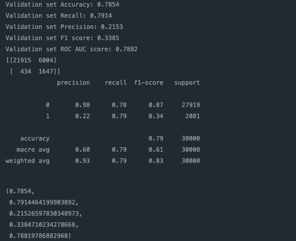

#### ROC AUC Curve
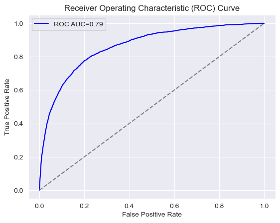

#### Confusion Matrix
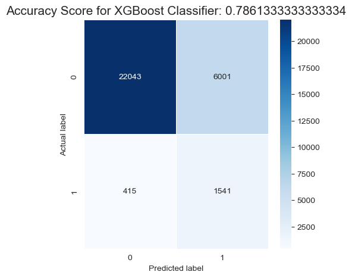

#### Model Interpretation

#### Feature Importance
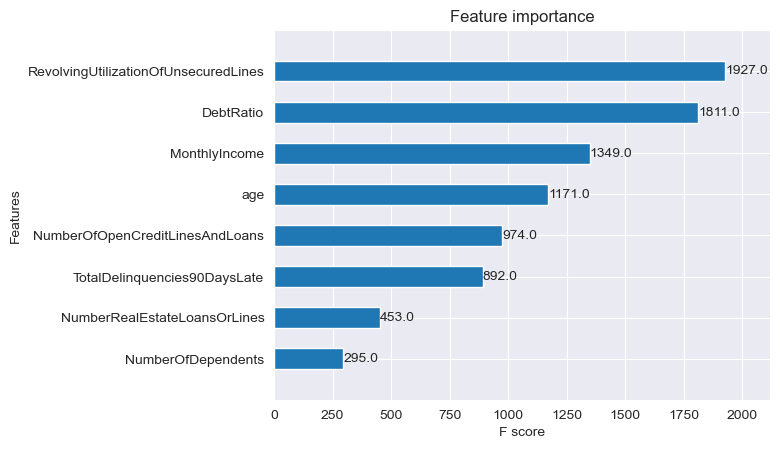

A feature importance analysis was performed on the XGBoost model. The most important features in predicting credit card defaults were identified, including RevolvingUtilizationOfUnsecuredLines, DebtRatio, and MonthlyIncome.

#### SHAP resutls
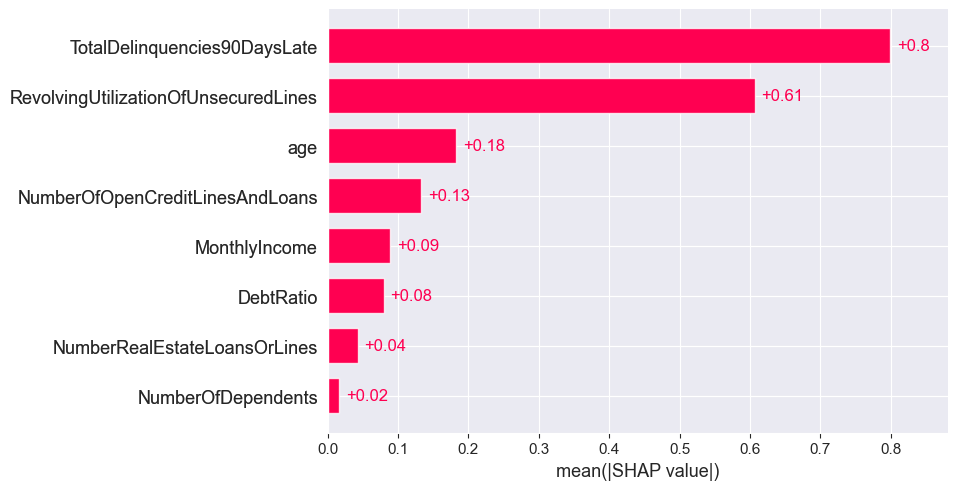

#### Default Probability List
In addition to predicting whether a customer will default or not, a Default probability list was generated to identify customers at a high risk of serious delinquency. 

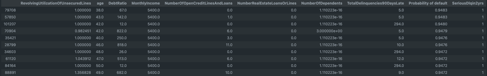

Top 10 at Risk

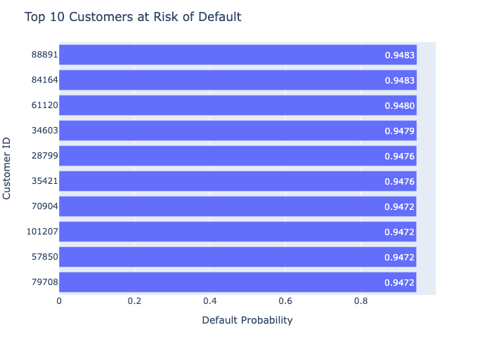

### Conclusion
In this project, we developed a credit card default prediction model using various machine learning algorithms. The XGBoost model with undersampling using RandomUnderSampler achieved the best performance, with a high ROC AUC score and reasonable precision, recall, and F1-score.

The feature importance analysis revealed that features such as RevolvingUtilizationOfUnsecuredLines, DebtRatio, and MonthlyIncome play crucial roles in predicting credit card defaults. This information can be utilized by credit card companies to identify customers who are at a high risk of defaulting and take appropriate actions to mitigate the risk.

Overall, this project provides a valuable tool for credit card companies to make informed decisions regarding customer creditworthiness, enabling them to manage their portfolios effectively and reduce the risk of defaults.
